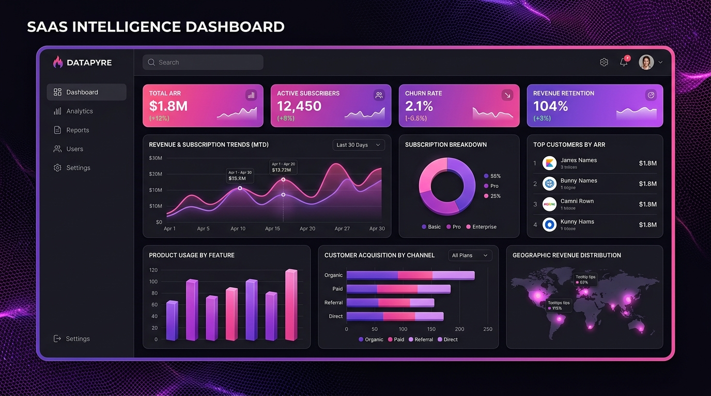

# Mobi5 Intelligence Dashboard



A premium, modern SaaS intelligence dashboard built with React and TypeScript. This application serves as a centralized hub for visualizing critical business metrics across Executive Overview, HR Intelligence, Assets & Property, and Finance.

## ✨ Features

- **Executive Overview**: High-level KPIs, overall growth trends, and real-time automated system insights.
- **HR Intelligence**: Track total headcount, attrition rates, open positions, department distribution, and a paginated employee directory.
- **Assets & Property**: Monitor total asset valuation, maintenance costs, categorized asset distribution, and paginated registry tracking.
- **Finance Metrics**: Visualize revenue vs expenses with dynamic radar/spider charts, cash flow analysis, profit margins, and a secure transactions ledger.
- **Kanban Insights**: A highly intuitive, actionable triage board for critical system alerts and warnings.
- **Fully Responsive**: Flawless grid and flexbox layouts that scale seamlessly from 4K desktop monitors down to 320px mobile devices.
- **Premium Aesthetics**: Bespoke "Light Mode" design system utilizing a vibrant custom palette, smooth micro-animations, and glassmorphism touches.

## 🛠 Tech Stack

- **Framework**: React 18
- **Build Tool**: Vite
- **Language**: TypeScript
- **Styling**: Vanilla CSS (CSS Variables, Grid, Flexbox)
- **Routing**: React Router DOM
- **Charting**: Recharts (Responsive SVG Charts)
- **Icons**: Lucide React

## 🚀 Getting Started

### Prerequisites

- Node.js (v16 or higher)
- npm or yarn

### Installation

1. Clone the repository
   ```bash
   git clone https://github.com/yourusername/mobi5-dashboard.git
   ```
2. Navigate to the project directory
   ```bash
   cd mobi5-dashboard
   ```
3. Install dependencies
   ```bash
   npm install
   ```
4. Start the development server
   ```bash
   npm run dev
   ```
5. Open your browser and navigate to `http://localhost:5173`

## 📁 Project Structure

```text
src/
├── components/
│   ├── charts/        # Reusable chart wrappers (ChartCard)
│   ├── layout/        # Core layout structures (TopBar, Sidebar)
│   └── ui/            # Reusable UI elements (KPICard, DataTable, Skeleton)
├── contexts/          # React Context providers (DataContext for mock state)
├── data/              # Mock data generation and TypeScript models
├── pages/             # Main dashboard views (Home, HR, Assets, Finance, Insights)
├── styles/            # Global CSS variables and utility classes
├── App.tsx            # Main application router
└── main.tsx           # React entry point
```

## 🎨 Design System

The application utilizes a strict, custom color palette designed for high contrast and modern SaaS appeal:
- **Primary Accent**: `#FF0066`
- **Secondary Dark**: `#6A0066`
- **Secondary Mid**: `#934790`
- **Beige/Borders**: `#E8D4B7`

## 📄 License

This project is licensed under the MIT License - see the LICENSE file for details.
